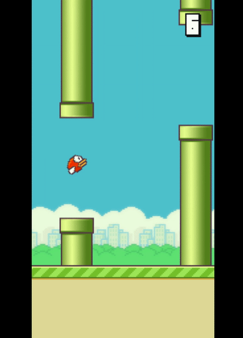

# Flappy Bird Web
A simple flappy bird minigame for web browsers using Phaser 3 game framework.

## Play on web
The minigame is available to play on browser, either on PC or mobile. Deployed at: [here](https://phassy-bird.vercel.app/).

## Some screenshots

## Run the project

| Command | Description |
|---------|-------------|
| `yarn install` | Install project dependencies |
| `yarn dev` | Builds project and open web server, watching for changes on http://localhost:3000 |
| `yarn build` | Builds code bundle with production settings |
| `yarn serve` | Run a web server to serve built code bundle on http://localhost:5000 |

## Technologies

- [Phaser 3](https://github.com/photonstorm/phaser)
- [TypeScript](https://www.typescriptlang.org/)
- [Rollup](https://rollupjs.org)
- [Vite](https://vitejs.dev/)